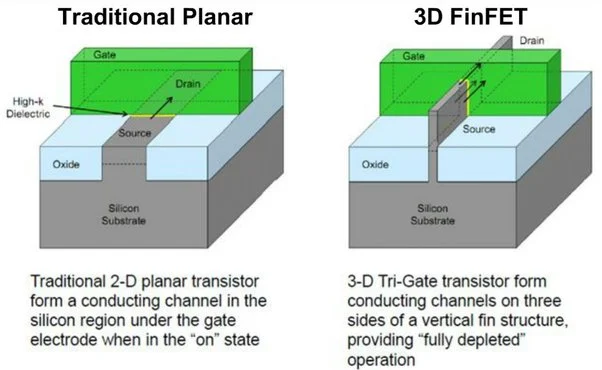
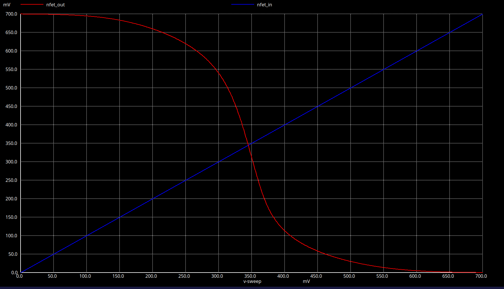
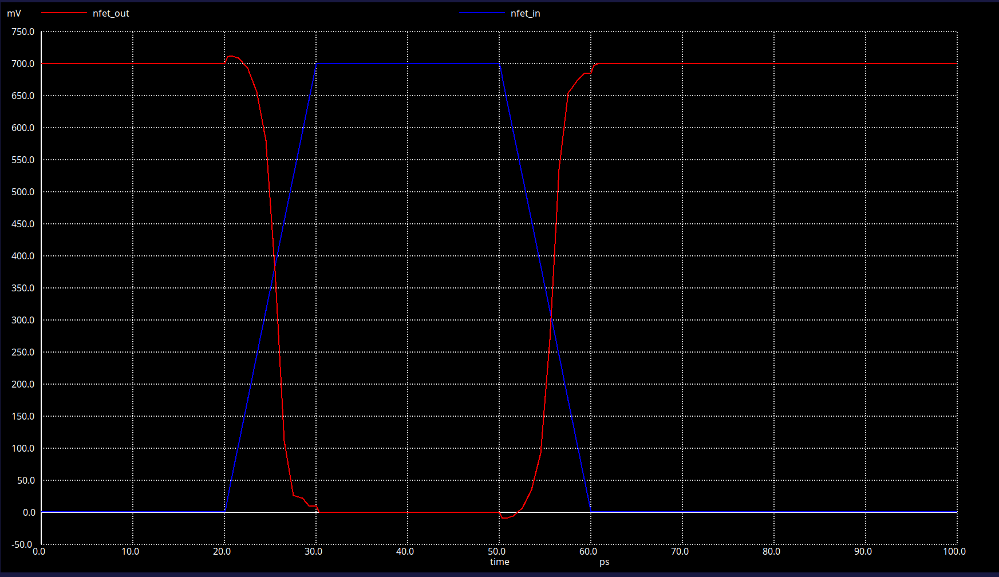
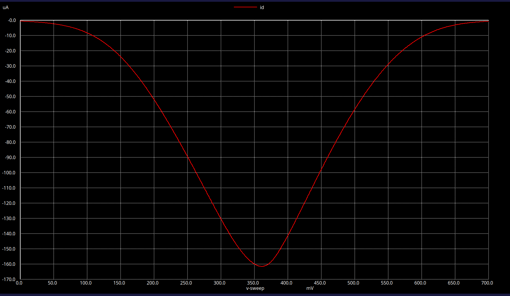
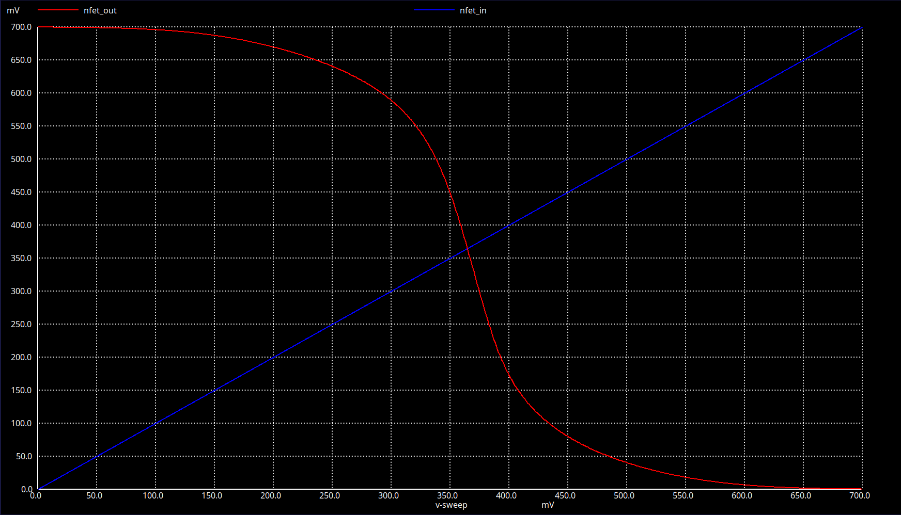
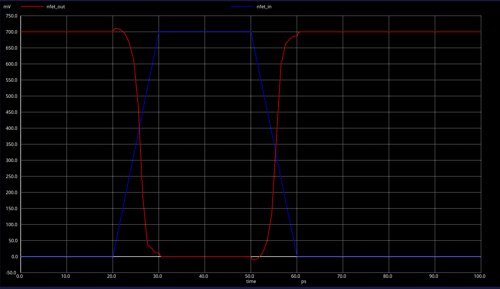
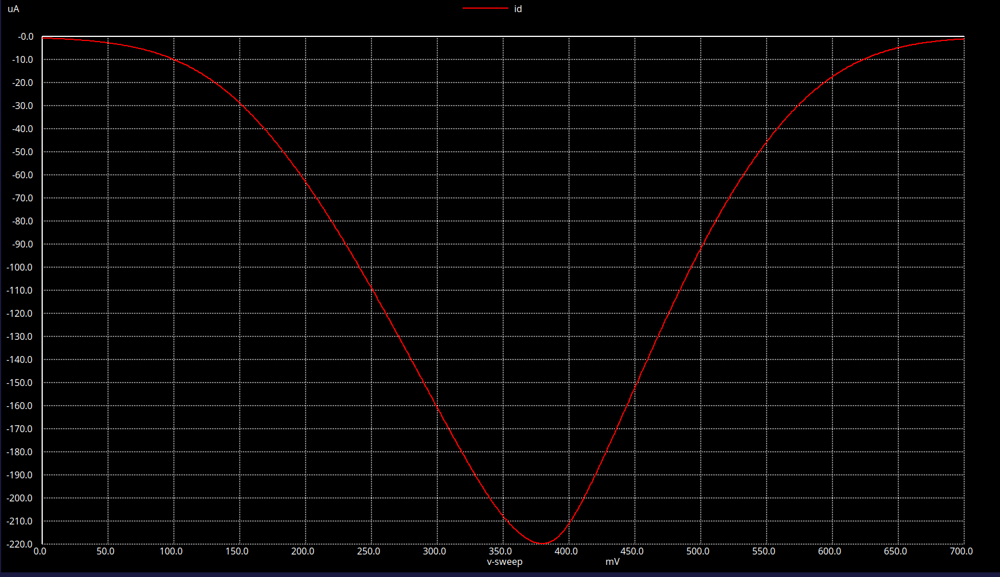
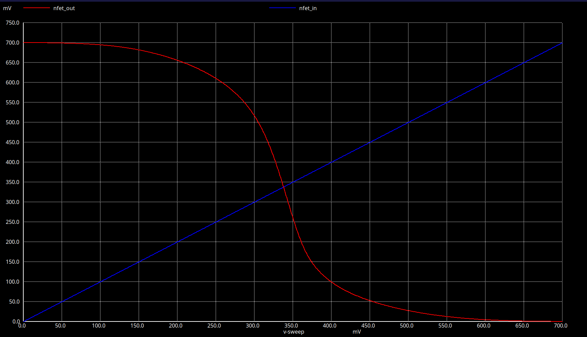
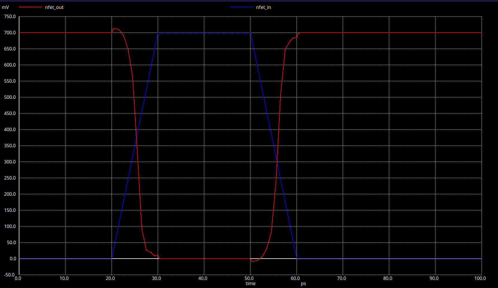

# Characterization of a CMOS Inverter using ASAP7 7nm FinFET PDK

---

### 1. Introduction

For decades, the semiconductor industry relied on flat, two-dimensional transistors known as planar MOSFETs to power microchips. However, as manufacturing technology advanced below the 22-nanometer (nm) node, these conventional transistors hit a physical barrier known as "short-channel effects."In a traditional planar transistor, the gate controls the flow of electricity through a channel from a single flat surface above. As transistors shrank, the source and drain terminals became too close together. The gate lost its physical grip over the channel, allowing electricity to leak through even when the transistor was turned "off." This resulted in massive power waste, high battery drain, and excessive heat generation.To overcome this bottleneck and sustain Moore's Law, the industry transitioned to a three-dimensional architecture: the Fin Field-Effect Transistor (FinFET).

<p align="center">
  
</p>

---

## 1.1 Structural Design and Working Principle

The defining feature of a FinFET is its thin, vertical silicon body that projects upward from the chip substrate, resembling a fish’s fin. This vertical fin acts as the conducting channel connecting the source and the drain.Instead of sitting flat on top, the gate electrode wraps around the three exposed sides of this vertical fin (the left, top, and right sides). This "tri-gate" design fundamentally improves how the transistor functions:

- Superior Electrical Control: By surrounding the channel on three sides, the gate gains maximum electrostatic control over the electrons. This prevents the drain voltage from accidentally pulling electrons through when the device should be off.
- Elimination of Leakage Current: Because the vertical fin is extremely thin, no part of the channel is hidden far from the gate's influence. The gate can easily switch off the entire channel, shrinking idle power leakage.
- Increased Effective Channel Width (\(W_{eff}\)): In electrical engineering, a wider channel means more current can flow, making the device faster. In a planar layout, making a channel wider requires taking up valuable horizontal space on the chip. In a FinFET, the effective width is increased vertically using the height of the fin. For a single fin, the formula is:

\(W_{eff}=(2\times H_{fin})+W_{fin}\)

Engineers can boost power simply by building taller fins or placing multiple fins side-by-side, saving physical space on the microchip.

---

## 1.2 Key Advantages for Modern Electronics

FinFET technology provides several critical upgrades over older, flat transistor designs:

- Energy Efficiency: Because FinFETs successfully stop current leakage, they can operate at much lower supply voltages. This allows smartphones and laptops to run faster while consuming significantly less battery power.
- Faster Switching Speeds: The three-sided gate structure allows more current to rush through the channel when the transistor is turned "on," enabling processors to achieve higher clock speeds and processing frequencies.
- Better Manufacturing Reliability: At microscopic scales, minor imperfections during manufacturing can cause transistors to behave unpredictably. The tight control of the FinFET architecture reduces these variations, making modern microchips highly reliable.

---

## 2. Tools

To analyze sub-10nm transistor dynamics accurately, this project implements a fully open-source electronic design automation (EDA) software stack. The simulation framework integrates layout schematic capture, numerical SPICE execution, predictive process files, and industry-standard compact transistor model mathematics.

---

## 2.1 Xschem

Xschem is an open-source, graphic-driven schematic editor optimized for Very Large Scale Integration (VLSI) circuit design. Rather than writing thousands of lines of raw text code to define the inverter by hand, Xschem provides a visual canvas to wire the PMOS and NMOS symbols.Once drawing is complete, the software maps out the coordinates and electrical properties to generate a dedicated hardware netlist file. This translation turns visual symbols into mathematical net lists so the simulator can analyze the structural loops.

---

## How to install Xschem in ubuntu

```bash
git clone https://github.com/StefanSchippers/xschem.git xschem
cd xschem
./configure 
make 
sudo make install 
cd ..
```
---

## 2.2 Ngspice 

Ngspice is a completely free, open-source program based on SPICE3f5, a famous simulation software originally created at the University of California, Berkeley. The program allows users to simulate both analog and digital electronic circuits, testing everything from small individual transistors up to large, complex computing systems. Because it is highly flexible and includes a wide range of useful tools, ngspice is widely popular for checking and designing circuits in both college classrooms and professional industries. The software has several built-in features that make it an excellent tool for engineering students and designers. It can model many different kinds of electronic setups, from simple circuit loops with basic resistors and capacitors to highly advanced integrated circuits (microchips). When running a simulation, the software supports multiple types of standard engineering tests:
- DC Analysis: Sweeps voltage input levels up and down to check how the circuit behaves under steady conditions.
- Transient Analysis: Tracks how electrical signals change over time, which is critical for finding out exactly how fast a circuit switches.
- AC and Noise Analysis: Measures how the circuit responds to different electrical frequencies and checks for unwanted signal interference.

To make these calculations possible, ngspice includes a built-in library filled with mathematical definitions for basic parts like diodes, older transistors (such as BJTs and MOSFETs), and operational amplifiers. One of its best features is that it can read and simulate netlists (circuit text files) written for other commercial SPICE software programs, which makes moving project files back and forth very easy.In the electronics field, ngspice is typically used for three main purposes. First, hobbyists and engineers use it to build virtual prototypes, letting them catch mistakes and refine their designs before spending money on real physical parts. Second, professors use it as a teaching tool to give students hands-on experience with circuit design inside a safe, computer-simulated space. Finally, researchers use it to explore how experimental electronic components might behave in the real world. Users can also expand the program by writing their own custom control scripts or adding new transistor models to fit specific research needs. Because the software is constantly updated and improved by a global community of developers, it remains highly reliable and up-to-date.

---

## How to install Ngspice 

```bash
#Clone the ngspice source repository
git clone https://git.code.sf.net/p/ngspice/ngspice ngspice_git
#Move into the source directory
cd ngspice_git
#Create a separate build directory
mkdir release
#Generate the configure script
./autogen.sh
#Enter the build directory
cd release
#Configure ngspice with OSDI and XSPICE support
../configure --with-x --enable-xspice --disable-debug --enable-cider --with-readline=yes --enable-openmp --enable-osdi
#Build ngspice
make
#Install ngspice
sudo make install
#Verify installation
ngspice -v
```
---

## 2.3 ASAP_7NM

When designing real microchips, semiconductor factories (called foundries) provide engineers with a digital package of files called a Process Design Kit (PDK). This kit contains all the specific blueprints, dimensions, and manufacturing laws required to build a chip at a certain size. However, because commercial 7nm factory files are highly secret and locked behind strict corporate non-disclosure agreements, they are completely unavailable to students. To solve this problem, our project uses the ASAP7 (Arizona State Automated Platform 7nm) Predictive PDK. Developed by researchers at Arizona State University alongside ARM Research, ASAP7 is a completely free, highly realistic simulation kit created specifically for academic research and college cell design.The ASAP7 PDK works by taking real industrial manufacturing parameters and scaling them down into a predictive computer model that behaves just like a real factory kit. 

Installation of the above PDK can be done by cloning the git repo at https://github.com/The-OpenROAD-Project/asap7

The complete workflow followed during this project is illustrated below.


---

## 2.4 BSIM_CGS

To accurately model our inverter, the simulation environment must include the BSIM-CMG (Berkeley Short-channel IGFET Model for Common Multi-Gate structures) framework. Developed by the specialized Device Model Working Group (DMWG) at the University of California, Berkeley, this is an advanced mathematical blueprint designed specifically for simulating three-dimensional transistors like FinFETs and nanowire structures. While older computer models were built for simple flat transistors, BSIM-CMG expands on those original formulas to capture how electric fields behave in 3D space. It handles highly complex microscopic anomalies, including gate coupling (how different sides of the gate work together), short-channel effects, and quantum wave behaviors. Because of its precision, this model is universally trusted across both college research and professional factory engineering to optimize and predict the speed and power of modern nanoscale microchips.

To practically use the BSIM-CMG framework for simulating our 7nm inverter, we must adjust our SPICE netlist configuration files. Specifically, we change the model file extensions from .pm to .sp inside our setup parameters.

For researchers looking to download or study the absolute latest versions of these multi-gate transistor blueprints, the official repository is hosted publicly by the university at https://www.bsim.berkeley.edu/models/bsimcmg/.

Because these advanced models describe complex physical behaviors, they are written in a hardware programming language called Verilog-A (.va extension). Since circuit engines like ngspice cannot read raw Verilog-A code directly, an open-source compiler tool called **OpenVAF** is required to translate them. OpenVAF processes the .va files and converts them into a compact binary mathematical format called an **.osdi** file. Once compilation is complete, this .osdi file must be placed directly into your active working directory alongside your main .sp SPICE netlist. 
Note that only modern versions of ngspice support external .osdi plugins; older versions will fail to recognize them. 

To compile smoothly, make sure the OpenVAF tool is downloaded from https://openvaf.semimod.de/

---

## SIMULATION RESULTS

| S.No. | PMOS (nfin) | NMOS (nfin) | V<sub>TH</sub> (V) | I<sub>D</sub> (A) | Power (W) | Gain (A<sub>v</sub>) | g<sub>m,max</sub> (mS) | Delay (ps) | Frequency (GHz) |
|:-----:|:-----------:|:-----------:|:------------------:|:-----------------:|:---------:|:--------------------:|:----------------------:|:----------:|:---------------:|
| 1 | 10 | 10 | 0.345064 | 5.8599 × 10⁻⁷ | 2.1317 × 10⁻⁵ | 6.424 | 0.883 | 25.297 | 22.467 |
| 2 | 16 | 12 | 0.364919 | 7.0337 × 10⁻⁷ | 2.9242 × 10⁻⁵ | 6.441 | 1.284 | 25.459 | 22.286 |
| 3 | 18 | 20 | 0.337759 | 1.1719 × 10⁻⁶ | 4.0497 × 10⁻⁵ | 6.432 | 1.641 | 25.221 | 22.516 |

---


## Configuration 1 (PMOS = 10, NMOS = 10)

### Voltage Transfer Characteristics

<p align="center">
  
</p>


### Delay Analysis

<p align="center">
  
</p>


### Drain Current

<p align="center">
  
</p>


---

## Configuration 2 (PMOS = 16, NMOS = 12)

### Voltage Transfer Characteristics

<p align="center">
  
</p>


### Delay Analysis

<p align="center">
  
</p>


### Drain Current

<p align="center">
  
</p>


---

## Configuration 3 (PMOS = 18, NMOS = 20)

### Voltage Transfer Characteristics

<p align="center">
  
</p>


### Delay Analysis

<p align="center">
  
</p>


### Drain Current

<p align="center">
  
</p>


---


# 📚 References

1. ASAP7 Predictive Process Design Kit (PDK)
2. BSIM-CMG Compact Model Documentation
3. Xschem User Manual
4. ngspice User Manual

---

## Author

**Param Sharma**

B.Tech Electronics and Communication Engineering

Manipal University Jaipur

